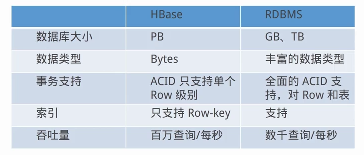

# Hbase

## Hbase简介

- Hbase是一个分布式的、面向列的开源数据库
- Hbase是在Hadoop和HDFS之上提供分布式数据存储
- Hbase适合非结构化数据存储

### Hbase与HDFS

- Hbase建立在Hadoop文件系统之上，利用Hadoop的文件系统的容错能力
- Hbase提供对数据的随机实时读/写访问功能
- Hbase内部使用哈希表，并存储索引，可将在HDFS文件中的数据进行快速查找

### Hbase数据模型

 - RowKey：决定一行记录的唯一标识，Hbase只支持三种查询方式（**`基于RowKey的单行查询`**、**`基于RowKey的范围查询`**、**`全表查询`**），RowKey是按照字典排序的，最多只能存储64k的字节数据

 - Column Family & qualifier：HBase表中每个列（qualifier）都属于某个列族，必须在使用表之前定义。 列名都以列族作为前缀，例如 courses:history、courses:math 都属于 courses 这个列族

 - TimeStamp：Hbase中使用不同的timestame来标识相同rowkey行对应的不同版本的数据。在写入数据时如果用户没有指定对应的timestamp，系统会自动添加一个与系统时间相同的timestamp。相同rowkey的数据按照timestamp倒序排列，默认查询的是最新的版本

 - cell：Cell 是由 {row key，column(=< family> + < qualifier>)，version} 唯一确定的单元。Cell 中的数据是没有类型的，全部是字节码形式存储 

 ### Hbase与传统关系型数据库对比

 

 ## Hbase安装

 ### 下载解压安装包：http://archive.cloudera.com/cdh5/cdh/5/hbase-1.2.0-cdh5.7.0.tar.gz
 ### 修改配置文件
 - hbase-env.sh
 ```bash
 export JAVA_HOME=$JAVA_HOME  
 #默认使用hbase自带的zookeeper  
 export HBASE_MANAGES_ZK=true  
 # Configure PermSize. Only needed in JDK7. You can safely remove it for JDK8+  
 # JDK8需加注释
export HBASE_MASTER_OPTS="$HBASE_MASTER_OPTS -XX:PermSize=128m -XX:MaxPermSize=128m"
export HBASE_REGIONSERVER_OPTS="$HBASE_REGIONSERVER_OPTS -XX:PermSize=128m -XX:MaxPermSize=128m"
```

- hbase-site.xml

|name|value|description|
|---|---|---|
|hbase.rootdir|hdfs://localhost:9000/hbase|regionserver的共享目录，用来持久化Hbase|
|hbase.zookeeper.property.dataDir|/Users/liufukang/app/hbase-1.2.0-cdh5.7.0/zookeeper|快照的存储位置|
|hbase.cluster.distributed|true|是否以分布式模式运行|
|hbase.zookeeper.quorm|localhost|zookeeper集群的地址列表|

- regionservers
> regionserver的地址

### 启动
`start-hbase.sh`

## Hbase基础架构
- 印象笔记已整理，TODO

## Hbase读写流程
- TODO

## Hbase实战
### Hbase Java API
- 开发HBase数据库操作类

- 通过多种过滤器过滤数据，实现HBase高级查询
    - 基于行的过滤器
    > PrefixFilter：行的前缀匹配  
    > PageFilter：基于行的分页
    - 基于列的过滤器
    > ColumnPrefixFilter：列前缀匹配  
    > FirstKeyOnlyFilter：只返回每一行的第一列
    - 基于单元值得过滤器
    > KeyOnlyFilter：返回的数据不包括单元值，只返回行键和列  
    > TimestampsFilter：根据数据的时间戳版本进行过滤
    - 基于列和单元值的过滤器
    > SingleColumnValueFilter：对该列的单元值进行比较过滤
    > SingleColumnValueExcludeFilter：对该列的单元值进行比较过滤
    - 比较过滤器
    > 比较过滤器通常需要一个比较运算符以及一个比较器来实现过滤  
    > RowFilter、FamilyFilter、QualifierFilter、ValueFilter